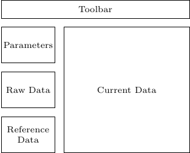
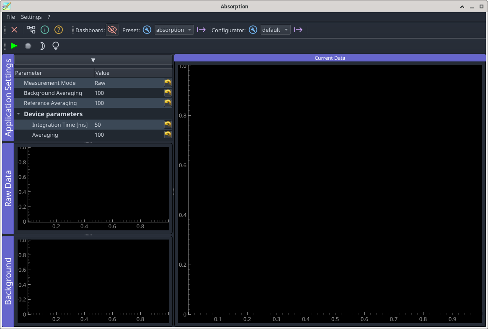

A simple absorption spectrometer
================================

The goal of this chapter is to turn the bare spectro-photometer into an absorption spectrometer. The spectrometer should have three working modes, display raw detector data, display background subtracted detector data and display absorption. A full absorption measurement needs the determination of the detector's dark signal, to be subtracted from each acquisition, and a reference of the incident light. The corresponding workflow is 

#. Determine the dark using the corresponding shutter.
#. Ask the user to insert a sample with pure solvent.
#. Perform the absorption measurement with the real sample.

Since the noise on the background and the reference data enter into each subsequent absorption measurement, it can be of advantage to accumulate these data with a larger number of samples. Therefore, an additional averaging parameter is introduced for each of these measurements.

.. code-block::
   :emphasize-lines: 3,7-19

    class Absorption(CustomExt):

        measurement_modes = [ 'Raw', 'Background Subtracted', 'Absorption' }

        ...

        application_params = [
            {'name': 'measurement_mode', 'title': 'Measurement Mode',
             'type': 'list', 'limits': measurement_modes,
             'tip': 'Measurement Mode', 'value': measurement_modes[0] },
            {'name': 'back_averaging', 'title': 'Background Averaging',
             'type': 'int', 'min': 1, 'max': 1000, 'value': 100,
             'tip': 'Background Software Averaging'},
            {'name': 'ref_averaging', 'title': 'Reference Averaging',
             'type': 'int', 'min': 1, 'max': 1000, 'value': 100,
             'tip': 'Reference Software Averaging'},
        ]

        params = application_params + [
        ...

To make the values of these settings persistent, their storage has to be updated as well

.. code-block::
   :emphasize-lines: 3-5,9-

        def read_settings(self, qt_settings):
            ...
            for param in self.application_params:
                self.settings[param['name']] = \
                    qt_settings.value(param['name'], param['value'])

        def write_settings(self, qt_settings):
            ...
            for param in self.application_params:
                qt_settings.setValue(name, self.settings[param['name']])

The GUI has also to be updated. It is always a good idea to display all data entering into the final result in some fashion.  A simple mockup ofthe GUI of our extension shows the general idea.

.. code-block::

    def setup_docks(self):
        ...
 
        # plot for raw spectrum data and reference 
        raw_data_dock = Dock('Raw Data')
        self.docks['raw-data'] = \
            self.dockarea.addDock(raw_data_dock, "bottom",
                                  self.docks['settings'])
        raw_data_widget = QWidget()
        self.raw_data_viewer = Viewer1D(raw_data_widget)
        self.raw_data_viewer.toolbar.hide()

        raw_data_dock.addWidget(raw_data_widget)

        # plot for background 
        background_dock = Dock('Background')
        self.docks['background'] = \
            self.dockarea.addDock(background_dock, "bottom",
                                  self.docks['raw-data'])
        background_widget = QWidget()
        self.background_viewer = Viewer1D(background_widget)
        background_dock.addWidget(background_widget)
        self.background_viewer.toolbar.hide()

Two new actions are needed

.. code-block::
   :emphasize-lines: 10-15,23-

    class Absorption(CustomExt):

    ...
 
        def setup_actions(self):
            self.add_action('acquire', 'Acquire', 'run2',
                            "Acquire", checkable=False, toolbar=self.toolbar)
            self.add_action('stop', 'Stop', 'stop2',
                            "Stop", checkable=False, toolbar=self.toolbar)
            self.add_action('background', 'Take Background', 'brightness_3',
                            "Take Background", checkable=False,
                            toolbar=self.toolbar)
            self.add_action('reference', 'Take Reference', 'lightbulb',
                            "Take Reference", checkable=False,
                            toolbar=self.toolbar)
        self._actions["stop"].setEnabled(False)

After deleting again the gui settings file, the extension should now look like

If you need icons which are not present in the icon library (:file:`pymodaq_gui/resources/icon_library`), you'll have to select suitable ones at https://fonts.google.com/icons. To be able to add them to PyMoDAQ's icon library you have to fork the PyMoDAQ repository, add the icons' names to the list in :file:`pymodaq_gui/resources/icons.toml` and follow the instructions in there and in :file:`pymodaq_gui/resources/check_icons_dev.py`. After a pull request, the additional icons will be available to all PyMoDAQ users. During development it is sufficient to install the pymodaq_gui package in editable mode within your work environment.

The newly defined actions do not yet trigger any real operations. However, we should prepare some book keeping to prevent exception being raised due to missing properties. In the 'Raw' mode, neither background nor reference data are needed. Both new actions should therefore be disabled in that mode. On the other hand, when selecting 'Background Subtracted', a measurement is not possible until the background has been recorded. Likewise, an absorption measurement is possible only, once both background and reference have been determined. The follwoing routine takes care of the correspong activation and deactivation operations.

.. code-block::

    class Absorption(CustomExt):

    ...

        def adjust_actions(self):

            def get_states(state):
                """acquire, back, ref"""
                if state == 'Raw':
                    return [True, False, False]
                if state == 'Background Subtracted':
                    return [self.have_background, True, False]
                if state == 'Absorption':
                    return [ self.have_reference, True, self.have_background]
                return [False, False, False] # busy

            is_idle = self.acquisition_mode == 'idle'
            self.docks['settings'].setEnabled(is_idle)
            self._actions["stop"].setEnabled(not is_idle)
            states = get_states(self.settings['measurement_mode'] if is_idle else '')
            for name,state in zip(["acquire", "background", "reference"], states):
                self._actions[name].setEnabled(state)

To make this work, we need to declare the flags at initialisation and to call this method whenever the measurement mode or the state of the flags has changed. Some other parameter changes may equally call for an update of the actions. E.g. the background signal depends on the integration time. Changing the latter we have to invalidate the former. We also have to distinguish between normal acqusition and acquisition of background and reference data. Furthermore, moving the shutter or waiting for the user to exchange samples, any incoming data should be discarded.

.. code-block::
   :emphasize-lines: 8-11,20-

    class Absorption(CustomExt):

    ...

        def __init__(self, parent: gutils.DockArea, dashboard):
            self.detector: DAQ_Viewer = None
            super().__init__(parent, dashboard)
            self.have_background = False
            self.have_reference = False
            self.acquisition_mode = 'idle'
            self.data_valid = False
            self.setup_ui()
            ...

        ...

        def value_changed(self, param):
            if param.name() == "integration_time":
                ...
                if self.settings['measurement_mode'] != 'Raw':
                    self.detector.stop()
                self.have_background = False
                self.have_reference = False
            self.adjust_actions()
  
Adjusting the actions may not be necessary each time some parameter has changed. However, it is safer just to do so.

Data coming in from the plugin have now to be handled differently, according to the acquisition mode. 

.. code-block::
   :emphasize-lines: 9-

    class Absorption(CustomExt):

    ...

        def take_data(self, data: DataToExport):
            ...
            self.n_samples = 0

            if self.settings['measurement_mode'] == 'Raw':
                self.show_data(mean, error, 'raw')
                return

            if self.acquisition_mode == 'normal':
                self.take_normal(mean, error)
            else:
                self.data_valid = False
                self.detector.stop_grab()
                am = self.acquisition_mode
                self.acquisition_mode = 'idle'
                if am == 'background':
                    self.take_background(mean, error)
                else:
                    self.take_reference(mean, error)

When measuring an absorption one has to pay attention to spectral regions with very low level signal from the whitelight lamp. In such regions on may obtain negative signals through fluctuations in the background and in consequence, the logarithm is not defined any more. To avoid :code:`NaN` values which may screw up the graphical display, a mask of validity is kept together with the reference signal.

.. code-block::

    class Absorption(CustomExt):

    ...

        def take_normal(self, mean, error):
            mean_signal = mean - self.background
            error_signal = np.sqrt(error**2 + self.error_background**2)

            if self.settings['measurement_mode'] == 'Background Subtracted':
                self.show_data(mean_signal, error_signal, 'signal', mean)
            else: # self.settings['measurement_mode'] == ABSORPTION:
                valid_mask = \
                    np.logical_and(mean_signal > 0, self.reference_valid_mask)
                self.absorption = \
                    np.where(valid_mask,
                             -np.log10(mean_signal / self.reference), 0)
                self.error_absorption = \
                    1 / np.log(10) \
                    * np.sqrt((error / mean_signal)**2
                              + ((self.error_reference + self.error_background)
                                 / self.reference)**2
                              + (1 / mean_signal - 1 / self.reference)**2
                                * self.error_background)

                self.show_data(self.absorption, self.error_absorption, 'absorption',
                               mean, self.reference)

        def take_background(self, mean, error):
            self.background = mean
            self.error_background = error
            self.have_background = True
            dfp = DataFromPlugins(name='Spectrograph',
                                  data=[self.background, self.error_background],
                                  dim='Data1D', labels=['background', 'error'],
                                  axes=[self.x_axis])
            self.spectrum_viewer.show_data(dfp)
            self.background_viewer.show_data(dfp)
            self.dark_shutter.move_abs(1200)

        def take_reference(self, mean, error):
            self.reference = mean - self.background
            self.error_reference = error
            self.reference_valid_mask = self.reference > 0
            self.have_reference = True
            dfp = DataFromPlugins(name='Spectrograph',
                                  data=[self.reference, self.error_reference],
                                  dim='Data1D', labels=['reference', 'error'],
                                  axes=[self.x_axis])
            self.spectrum_viewer.show_data(dfp)
            self.raw_data_viewer.show_data(dfp)
            if hasattr(self.detector.controller, 'with_sample'):
                self.detector.controller.with_sample = True
            self.adjust_actions()

        def show_data(self, mean, error, name, raw=None, reference=None):
            dfp = DataFromPlugins(name=name, data=[mean, error], dim='Data1D',
                                  labels=[name, 'error'], axes=[self.x_axis])
            self.spectrum_viewer.show_data(dfp)
            if raw is not None:
                data = [raw]
                labels = ['raw signal']
                if reference is not None:
                    data.append(reference)
                    labels.append('reference')
                dfp = DataFromPlugins(name='raw', data=data, dim='Data1D',
                                      labels=labels, axes=[self.x_axis])
                self.raw_data_viewer.show_data(dfp)

To make things operative, the actions have be connected to the corresponding methods.

.. code-block::
   :emphasize-lines: 8-

    class Absorption(CustomExt):

    ....

        def connect_things(self):
            self.connect_action('acquire', self.start_acquiring)
            self.connect_action('stop', self.stop_acquiring)
            self.connect_action('background', self.take_background)
            self.connect_action('reference', self.take_reference)

.. code-block::

    class Absorption(CustomExt):

    ...
 
        def setup_menu(self, menubar: QtWidgets.QMenuBar = None):
            file_menu = self.mainwindow.menuBar().addMenu('File')
            self.affect_to('save', file_menu)
            file_menu.addSeparator()
            #self.affect_to('quit', file_menu)
 
