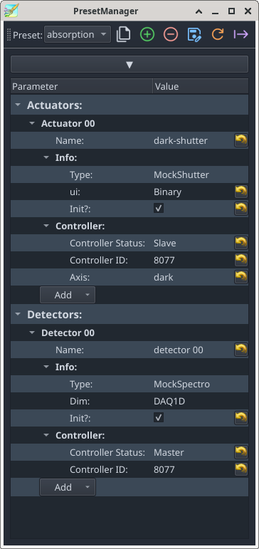
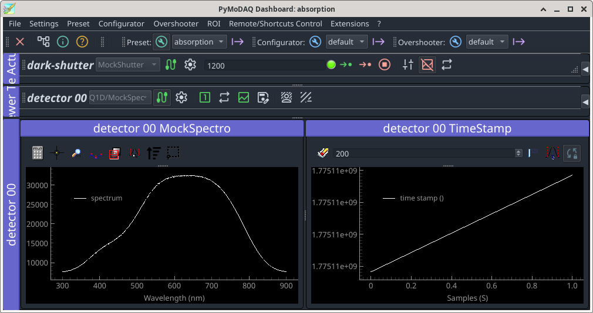
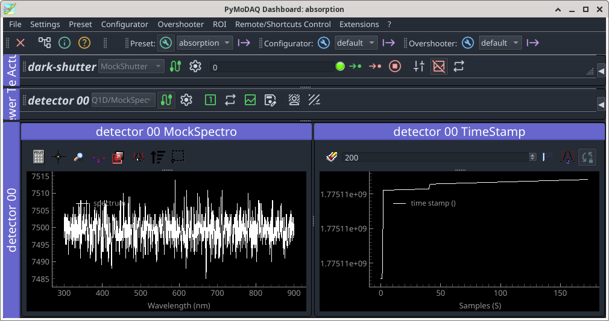

Playing with the devices in the dashboard
=========================================

To let the simulated spectrometer and shutter act together we have to join them in a dashboard preset. Start the dashboard, open the preset manager and click the icon for generating a new preset. Name it 'absorption' and add an actuator of type MockShutter and a detector of type MockSpectro. Your preset definition should now look like

Change the values in the fields according to the above image. It is important that the actuator is marked as Slave and the detector as Master and that they share the same Controller ID (the actual number doesn't matter at all).

Once you launch the preset, your dashboard should present the dark shutter plugin GUI and the spectrometer plugin GUI.

Start continuous grabbing on the spectrometer and watch the displayed data switching between dark and illuminated signal as you click on the red and green arrows in the move's GUI to open and close the virtual shutter.

Now that we have everything from the instrument side in place, it is time to start coding the spectrometer extension.
