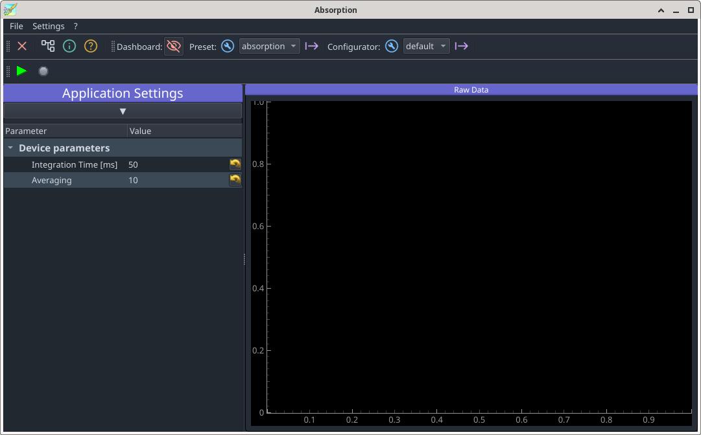

Extension Plugin
================

In a first step we have to modify the file:`pyproject.toml` in the module's root directory to tell PyMoDAQ that this module also contains an extension.

.. code-block::
   :emphasize-lines: 3

    [features]
    instruments = true
    extensions = true
    models = false
    ...

Next we have to move to the extension folder

.. code-block::

   $ mv src/pymodaq_plugins_tutorial_extension/extensions

and rename the extension template in the extension folder, giving it a meaningful name.

.. code-block::

   .../extension$ git mv custom_extension_template.py absorption_extension.py

Now load the renamed file and adapt the names close to the top of the file according to the instructions given in the comments inside the file. Following the initial import declarations, the top of the file should afterwards look like this

.. code-block::

    ...
    from pymodaq_plugins_tutorial_extension.utils import Config as PluginConfig

    logger = set_logger(get_module_name(__file__))

    main_config = Config()
    plugin_config = PluginConfig()

    EXTENSION_NAME = 'Absorption'
    CLASS_NAME = 'Absorption'

    class Absorption(CustomExt):
    ...

Next comes the initialisation of the instance of the absorption extension. For the moment we just declare the type of the detector so that an IDE can guess it.

.. code-block::

    class Absorption(CustomExt):

    ...
 
        def __init__(self, parent: gutils.DockArea, dashboard):
            self.detector: DAQ_Viewer = None
            super().__init__(parent, dashboard)
            self.setup_ui()

Though the method :code:`setup_ui` needs to be called in any custom extension, this is not done in the inherited classes' initialisation to permit setting up some matter which is needed to initilise its UI but needs in turn the parent class already to be initialised.

The main window of the application is accessible through the instance variable :code:`self.dockarea`. Any widgets can be added to this area via instances of :code:`Dock'. the following code creates the display for the current measurement. It should be pretty self explaining.

.. code-block::

    class Absorption(CustomExt):

    ...
 
        def setup_docks(self):
            self.create_dashboard_toolbar()

            self.spectrum_label = DockLabel("Raw Data")
            spectrum_dock = Dock('Data', label=self.spectrum_label)
            self.docks['spectrum'] = \
                self.dockarea.addDock(spectrum_dock, "right",
                                      self.docks['settings'])
            spectrum_widget = QtWidgets.QWidget()
            self.spectrum_viewer = Viewer1D(spectrum_widget)
            self.spectrum_viewer.toolbar.hide()
            spectrum_dock.addWidget(spectrum_widget)

To be able to test the newly constructed GUI, method populated later has to be temporarily disabled.

.. code-block::
   :emphasize-lines: 6

    class Absorption(CustomExt):

    ...
 
        def setup_actions(self):
            return
            """Method where to create actions to be subclassed. Mandatory
            ...
            
The dashboard may now be launched

.. code-block::

   $ dashboard -p absorption

The list of extensions should contain now an entry "Absorption". After starting it, a window should pop up which looks like the following

.. image:: bare-extension.png

However, it hasn't got any functionality yet. To get things working in a preliminary and primitive fashion we add a method that accepts data from the spectrograph's 1D viewer plugin. It simply extracts the raw spectrometer data from the received :code:`DataToExport` object and displays that in the viewer.

.. code-block::

    class Absorption(CustomExt):

    ...
 
        def take_data(self, data: DataToExport):
            spectro_data = data.get_data_from_dim('Data1D')[0]
            self.spectrum_viewer.show_data(spectro_data)

Once the dashboard has been loaded with the preset, the devices defined in the preset can be registered with the modules manager. This allows to obtain a reference to the detector which can be connected to the data display.

.. code-block::

    class Absorption(CustomExt):

    ...

        def do_things_after_preset_set(self, preset_name: str):
            self.modules_manager.detectors_all = \
                self.dashboard.modules_manager.detectors_all

            self.detector = \
                self.modules_manager.get_mod_from_name('Spectrometer',
                                                       ModuleType.Detector)
            self.detector.grab_done_signal.connect(self.take_data)
            self.x_axis = \
                Axis(label='Wavelength', units='nm',
                     data=self.detector.controller.wavelengths, index=0)

Note that it is assumed here for sake of simplicity and for the now that the spectrometer exports its wavelength calibration by a :code:`wavelength` property. This may not be the case for any spectrograph and will be covered in a more general fashion later. There's another issue here how to identify the device of choice. :code:`ModulesManager.get_mod_from_name` needs to get the name  exactly as we have defined it in the preset. However, how should a non-developping user know what to enter there, unless having been specificly instructed? We'll cover that later with an appropriated configuration dialog. For now, we'll have to pay attention that the two names match exactly.

Two methods take care of starting and ending the acquisition 

.. code-block::

    class Absorption(CustomExt):

    ...

        def start_acquiring(self):
            self.detector.grab()

        def stop_acquiring(self):
            self.detector.stop_grab()

To make them acessible by the GUI, two methods predefined in the template have to be populated

.. code-block::

    def setup_actions(self):
        self.add_action('acquire', 'Acquire', 'run2',
                        "Acquire", checkable=False, toolbar=self.toolbar)
        self.add_action('stop', 'Stop', 'stop2',
                        "Stop", checkable=False, toolbar=self.toolbar)

    def connect_things(self):
        self.connect_action('acquire', self.start_acquiring)
        self.connect_action('stop', self.stop_acquiring)

The extension has now a tool bar from which the acquistion can be started and stopped.

.. image:: extension-with-toolbar.png

At this point the extension does nothing more than what is already happening in the panel named "Spectrometer MockSpectro" in the dashboard. When starting acquisition in the extension, the recorded data is updated both in the extension and in the dashboard, while starting the acquisition in the latter, data is updated on the latter.

Stopping acquisition before it has been started doesn't make much sense. PyMoDAQ still handles the situation correctly. However, necessary actions unknown to PyMoDAQ may not do so. It is therefore better to activate only those actions which actually make sense.

.. code-block::
   :emphasize-lines: 6,7,11,12

    def setup_actions(self):
        ...
        self._actions["stop"].setEnabled(False)

    def start_acquiring(self):
        self._actions["acquire"].setEnabled(False)
        self._actions["stop"].setEnabled(True)
        self.detector.grab()

    def stop_acquiring(self):
        self._actions["acquire"].setEnabled(True)
        self._actions["stop"].setEnabled(False)
        self.detector.stop_grab()

Note that this introduces a bug. The dasboard is of course not aware of the functionality created in the extension. When starting or stopping the acquisition, the tool bar buttons in the extension are not updated. this will be addressed later on.

You may have noticed while playing around with the extension that opens up with size which is not very suitable. And changes to the window are not preserved over quitting the dashboard. Let's make changes to the GUI staying permanently. Two functions, inverse of each other, take care of writing the current parameter values and geometry settings to a configuration file and reading them back. This is done here in a preliminary fashion using Qt's settings mechanism. **@PyMoDAQxperts:** please replace this with more PyMoDAQonian style ...

.. code-block::

    def write_settings(self, qt_settings):
        qt_settings.setValue("geometry", self.mainwindow.saveGeometry())
        qt_settings.setValue("dockarea", self.dockarea.saveState())
        for name in self.settings_entries:
            qt_settings.setValue(name, self.settings[name])

   def read_settings(self, qt_settings):
        geometry = self.qt_settings.value("geometry", QByteArray())
        self.mainwindow.restoreGeometry(geometry)
        state = self.qt_settings.value("dockarea", None)
        if state is not None:
            try:
                self.dockarea.restoreState(state)
            except: # pyqtgraph's state restoring is not very fail safe
                # erease inconsistent settings in case pyqtgraph trips
                self.qt_settings.setValue("dockarea", None)

        for name in self.settings_entries:
            value = qt_settings.value(name, None)
            if value is not None:
                self.settings[name] = value
        
To make this work, the two functions have to be hooked up into the initialisation and shut down procedures.

.. code-block::
   :emphasize-lines: 4-7,9-

    def __init__(self, parent: gutils.DockArea, dashboard):
        ...
        self.setup_ui()
        config_dir = get_set_config_dir("gui-state", user=True)
        settings_file_name = f'{config_dir}/{EXTENSION_NAME}.conf'
        self.qt_settings = QSettings(settings_file_name, QSettings.NativeFormat)
        self.read_settings(self.qt_settings)
        
    def quit_fun(self):
        self.write_settings(self.qt_settings)

The first newly introduced line in the init method returns a path to a subfolder :file:`gui-state` located in the user's PyMoDAQ configuration folder. If that subfolder didn't exist yet its is creared. GUI settings can go in there now. Have a try. Resizing the extension window should now persist over shutting down and restarting the extension and the dashboard.

The paramaters controlling the spectrometer are all accessible in the preset and could be changed via the detector's widget in the dashboard. However, to ease operating the device, a set of most important parameters shall be displayed in the main window of the spectrometer application. They are declared in the preamble of the extension class in the same fashion as device parameters in the preamble of a plugin class. All parameters defined in :code:`params[]` are avaliable in :code:`self.settings_tree`.

.. code-block::
   :emphasize-lines: 20-22

    class Absorption(CustomExt):

        ...

        params = [
            {'name': 'device_params', 'title': 'Device parameters', 'type': 'group',
             'children': [
                 {'name': 'integration_time', 'title': 'Integration Time [ms]',
                  'type': 'float', 'min': 0.001, 'max': 10000, 'value': 50,
                  'tip': 'Integration time in seconds'},
                 {'name': 'averaging', 'title': 'Averaging',
                  'type': 'int', 'min': 1, 'max': 1000, 'value': 10,
                  'tip': 'Software Averaging'},
               ]
             },
           ]

        ...

        def setup_docks(self):
            self.create_dashboard_toolbar()

            self.docks['settings'] = Dock('Application Settings')
            self.dockarea.addDock(self.docks['settings'])
            self.docks['settings'].addWidget(self.settings_tree)

            self.spectrum_label = DockLabel("Raw Data")
            ...

To make the detector aware of parameter changes, another predefined method has to be populated

.. code-block::

    class Absorption(CustomExt):

    ...
 
        def value_changed(self, param):
            if param.name() == "integration_time":
                self.detector.settings.child('detector_settings',
                                             'integration_time') \
                                      .setValue(param.value())

To prevent the contents of an obsolete configuration file messing up the layout, remove the file in question

.. code-block::

   $ rm ~/.pymodaq/gui-state/Absorption.conf

The Absorption extension should now look like

The parameter ``Average`` has not yet any effect. Let's change that. 

.. code-block::
   :emphasize-lines: 7-20,25,26

    class Absorption(CustomExt):

        ...

        def take_data(self, data: DataToExport):
            spectro_data = data.get_data_from_dim('Data1D')[0]
            self.n_samples = self.accumulate_data(spectro_data[0], self.n_samples)
            if self.n_samples < self.n_average:
                return
            
            if self.n_average < 2:
                self.spectrum_viewer.show_data(spectro_data)
                return

            mean, error = \
                self.average_data(self.sum_data, self.squares_data, self.n_samples)
            dfp = DataFromPlugins(name=name, data=[mean, error], dim='Data1D',
                                  labels=[name, 'error'], axes=[self.x_axis])
            self.spectrum_viewer.show_data(dfp)
            self.n_samples = 0

        ....

        def start_acquiring(self):
            self.n_samples = 0
            self.n_average = self.settings.child('device_params')['averaging']
            ...

        def accumulate_data(self, data, n_samples):
            if n_samples:
                self.sum_data += data
                self.squares_data += data**2
            else:
                self.sum_data = data
                self.squares_data = data**2
            return n_samples + 1

        def average_data(self, sum_data, squares_data, n_samples):
            mean = sum_data / n_samples
            error = np.sqrt((n_samples * squares_data - sum_data**2)
                            / (n_samples**2 * (n_samples - 1)))
            return mean, error

Zooming in on the error curve permits to see how the error scales now with :math:`\sqrt{n_\mathrm{average}}`.

Once again, changes on the parameters do not survive quitting. One could write them to and recover them from a config file one by one. However, expecting the number of parameters to increase with time, it will be advantageous on the long run to prepare for that now. Since the device params are a dict inside a dirct inside an array, it is easier to declare them in a separate list 

.. code-block::
   :emphasize-lines: 3-15,21-23,27-
   
    class Absorption(CustomExt):

        device_params = [
            {'name': 'integration_time', 'title': 'Integration Time [ms]',
             'type': 'float', 'min': 0.001, 'max': 10000, 'value': 50,
             'tip': 'Integration time in seconds'},
            {'name': 'averaging', 'title': 'Averaging',
             'type': 'int', 'min': 1, 'max': 1000, 'value': 10,
             'tip': 'Software Averaging'},
            ]

        params = [
            {'name': 'device_params', 'title': 'Device parameters', 'type': 'group',
             'children': device_params },
            ]

    ...
 
        def read_settings(self, qt_settings):
            ...
            for param in self.device_params:
                self.settings.child('device_params')[param['name']] = \
                    qt_settings.value(param['name'], param['value'])

        def write_settings(self, qt_settings):
            ...
            for param in self.device_params:
                qt_settings.setValue(name, 
                                     self.settings.child('device_params')[param['name']])

The second argument of :code:`QSettings.value` is a default value which prevents a :code:`None` value being inserted when the entry asked for is not present in the configuration file, which would cause an exception to be raised.

Until now, the extension does nothing more than a bare plugin can do. Deatures beyod will be introduced in the next chapter.
