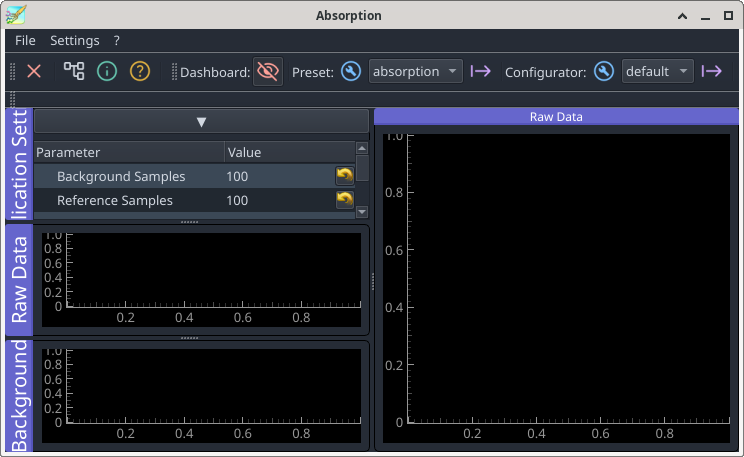
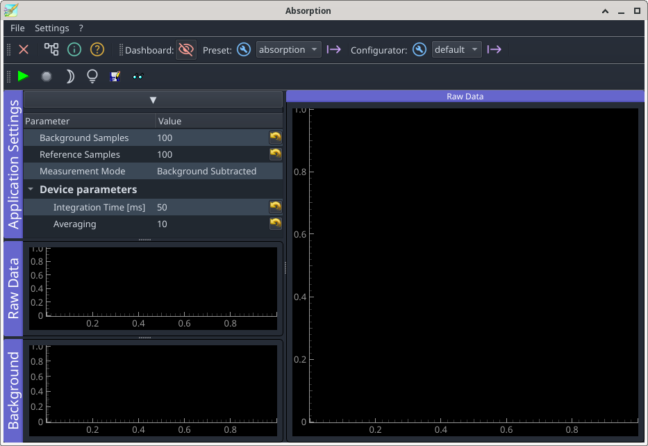

Extension Plugin
================

In a first step we have to modify the file:`pyproject.toml` in the module's root directory to tell PyMoDAQ that this module also contains an extension.

.. code-block::
   :emphasize-lines: 3

    [features]
    instruments = true
    extensions = true
    models = false
    ...

Next we have to moveto the extension folder

.. code-block::

   $ mv src/pymodaq_plugins_tutorial_extension/extensions

and rename the extension template in the extension folder, giving it a meaningful name.

.. code-block::

   .../extension$ git mv custom_extension_template.py absorption_extension.py

Now load the renamed file and adapt the names close to the top of the file according to the instructions given in the comments inside the file. Following the initial import declarations, the top of the file should afterwards look like this

.. code-block::

    ...
    from pymodaq_plugins_tutorial_extension.utils import Config as PluginConfig

    logger = set_logger(get_module_name(__file__))

    main_config = Config()
    plugin_config = PluginConfig()

    EXTENSION_NAME = 'Absorption'
    CLASS_NAME = 'Absorption'

    class Absorption(CustomExt):
    ...

The spectrometer program shall have three different modes of operation, display raw data, display background subtracted data and display absorption. Let's define constants to reflect these modes at the top level of the extension file

.. code-block::
   :emphasize-lines: 4-6,10-

    ...
    CLASS_NAME = 'Absorption'

    RAW             = 0
    WITH_BACKGROUND = 1
    ABSORPTION      = 2

    class Absorption(CustomExt):

        measurement_modes = {
            'Raw': RAW, 'Background Subtracted': WITH_BACKGROUND,
            'Absorption': ABSORPTION
            }

The paramaters controlling the spectrometer are all accessible in the preset and could be changed via a parameter tree in a deticated detector view. However, to ease operating the device, we'll define a set of most important parameters in the preable of the extension's class which will be displayed in the main window of the spectrometer application.

.. code-block::

    class Absorption(CustomExt):

        ...

        params = [
            {'name': 'back_samples', 'title': 'Background Samples',
             'type': 'int', 'min': 1, 'max': 1000, 'value': 100,
             'tip': 'Background Software Averaging'},
            {'name': 'ref_samples', 'title': 'Reference Samples',
             'type': 'int', 'min': 1, 'max': 1000, 'value': 100,
             'tip': 'Reference Software Averaging'},
            {'name': 'measurement_mode', 'title': 'Measurement Mode',
             'type': 'list', 'limits': list(measurement_modes.keys()),
             'tip': 'Measurement Mode'},
            {'name': 'device_params', 'title': 'Device parameters', 'type': 'group',
             'children': [
                 {'name': 'integration_time', 'title': 'Integration Time [ms]',
                  'type': 'float', 'min': 0.001, 'max': 10000, 'value': 50,
                  'tip': 'Integration time in seconds'},
                 {'name': 'averaging', 'title': 'Averaging',
                  'type': 'int', 'min': 1, 'max': 1000, 'value': 10,
                  'tip': 'Software Averaging'},
                 ]
             },
           ]

Next comes the initialisation of the instance of the absorption extension. For the moment we just declare the type of the detector so that an IDE can guess it.

.. code-block::

    class Absorption(CustomExt):

    ...
 
        def __init__(self, parent: gutils.DockArea, dashboard):
            self.detector: DAQ_Viewer = None
            super().__init__(parent, dashboard)
            self.setup_ui()

A simple mockup ofthe GUI of our extension shows the general idea.

.. image:: extension-mockup.png
   :align: center

The top left of the main window contains a list of general controlling parameters. Two graphics for displaying auxiliary data are placed below this area. The current acquisition is displayed in the main DAQ_Viewer on the right.

Each widget, be that a code:`ParameterTree` or a code:`DAQ_Viewer` or anything else is placed into a dock. An instance variable of the extension takes care of the book keeping of docks.

.. code-block::

    class Absorption(CustomExt):

    ...
 
        def setup_docks(self):
            # left column: essential parameters at top, small plots for dark and
            # reference signals
            # main area for current data
            self.create_dashboard_toolbar()

            # top left, essential parameters
            self.docks['settings'] = Dock('Application Settings')
            self.dockarea.addDock(self.docks['settings'])
            self.docks['settings'].addWidget(self.settings_tree)

After this example the follwoing code for the rest of the GUI should be pretty self expalining.

.. code-block::

    def setup_docks(self):
    ...
        # main area with spectrum plot
        self.spectrum_label = DockLabel("Raw Data")
        spectrum_dock = Dock('Data', label=self.spectrum_label)
        self.docks['spectrum'] = \
            self.dockarea.addDock(spectrum_dock, "right",
                                  self.docks['settings'])
        spectrum_widget = QWidget()
        self.spectrum_viewer = Viewer1D(spectrum_widget)
        self.spectrum_viewer.toolbar.hide()
        spectrum_dock.addWidget(spectrum_widget)

        # plot for raw spectrum data and reference 
        raw_data_dock = Dock('Raw Data')
        self.docks['raw-data'] = \
            self.dockarea.addDock(raw_data_dock, "bottom",
                                  self.docks['settings'])
        raw_data_widget = QWidget()
        self.raw_data_viewer = Viewer1D(raw_data_widget)
        self.raw_data_viewer.toolbar.hide()

        raw_data_dock.addWidget(raw_data_widget)

        # plot for background 
        background_dock = Dock('Background')
        self.docks['background'] = \
            self.dockarea.addDock(background_dock, "bottom",
                                  self.docks['raw-data'])
        background_widget = QWidget()
        self.background_viewer = Viewer1D(background_widget)
        background_dock.addWidget(background_widget)
        self.background_viewer.toolbar.hide()

To be able to test the newly constructed GUI we have to temporarily disable a method which has to be populated later, once we've implemented the methods to be called therein.

.. code-block::
   :emphasize-lines: 6

    class Absorption(CustomExt):

    ...
 
        def setup_actions(self):
            return
            """Method where to create actions to be subclassed. Mandatory
            ...
            
We may now launch the dashboard

.. code-block::

   $ dashboard -p absorption

The list of extensions should contain now an entry "Absorption". After launching our extension, a window should pop up which looks like the following

We can play with this extension. But it hasn't got any functionality yet. Note that when changing the measurement mode, an exception about a missing attribute is raised. This is correct because that attribute is yet to be coded.
To access all entries on the parameter tree, the window will probably have to be resized. Upon shutting down and restarting the dashboard, the extension's window will show up again at its original size, which is probably not what is wanted. Let's make changes to the GUI staying permanently. Two functions, inverse of each other, take care of writing the current parameter values and geometry settings to a configuration file and reading them back. This is done here in a preliminary fashion using Qt's settings mechanism. **@PyMoDAQxperts:** please replace this with more PyMoDAQonian style ...

.. code-block::

    def write_settings(self, qt_settings):
        qt_settings.setValue("geometry", self.mainwindow.saveGeometry())
        qt_settings.setValue("dockarea", self.dockarea.saveState())
        for name in self.settings_entries:
            qt_settings.setValue(name, self.settings[name])

   def read_settings(self, qt_settings):
        geometry = self.qt_settings.value("geometry", QByteArray())
        self.mainwindow.restoreGeometry(geometry)
        state = self.qt_settings.value("dockarea", None)
        if state is not None:
            try:
                self.dockarea.restoreState(state)
            except: # pyqtgraph's state restoring is not very fail safe
                # erease inconsistent settings in case pyqtgraph trips
                self.qt_settings.setValue("dockarea", None)

        for name in self.settings_entries:
            value = qt_settings.value(name, None)
            if value is not None:
                self.settings[name] = value
        
To make this work, the two functions have to be hooked up into the initialisation and shut down procedures.

.. code-block::
   :emphasize-lines: 6-9,11-

    def __init__(self, parent: gutils.DockArea, dashboard):
        ...
        self.measurement_mode = \
            self.measurement_modes[self.settings['measurement_mode']]

        config_dir = get_set_config_dir("gui-state", user=True)
        settings_file_name = f'{config_dir}/{EXTENSION_NAME}.conf'
        self.qt_settings = QSettings(settings_file_name, QSettings.NativeFormat)
        self.read_settings(self.qt_settings)
        
    def quit_fun(self):
        self.write_settings(self.qt_settings)

Have a try. Resizing the extension window should now persist over shutting down and restarting the dashboard.

Before addressing real measurement matter, let's fill first in the yet missing boiler plate code. We start with the actions to be defined in the toolbar

.. code-block::

    class Absorption(CustomExt):

    ...
 
        def setup_actions(self):
            self.add_action('acquire', 'Acquire', 'run2',
                            "Acquire", checkable=False, toolbar=self.toolbar)
            self.add_action('stop', 'Stop', 'stop2',
                            "Stop", checkable=False, toolbar=self.toolbar)
            self.add_action('background', 'Take Background', 'brightness_3',
                            "Take Background", checkable=False,
                            toolbar=self.toolbar)
            self.add_action('reference', 'Take Reference', 'lightbulb',
                            "Take Reference", checkable=False,
                            toolbar=self.toolbar)
            self.add_action('save', 'Save', 'SaveAs', "Save current data",
                            checkable=False, toolbar=self.toolbar)        
            self.add_action('show', 'Show/hide', 'read2', "Show Hide DAQViewer",
                            checkable=True, toolbar=self.toolbar)
            self._actions["stop"].setEnabled(False)

When launching the extension from the dashboard, a toolbar with the spectrometer actions should show up now.

If you need icons which are not present in the icon library (:file:`pymodaq_gui/resources/icon_library`), you'll have to select suitable ones at https://fonts.google.com/icons. To be able to add them to PyMoDAQ's icon library you have to fork the PyMoDAQ repository, add the icons' names to the list in :file:`pymodaq_gui/resources/icons.toml` and follow the instructions in there and in :file:`pymodaq_gui/resources/check_icons_dev.py`. After a pull request, the additional icons will be available to all PyMoDAQ users. During development it is sufficient to install the pymodaq_gui package in editable mode within your work environment.

The newly defined actions do not yet trigger any real operations. We'll dive into that now. Incoming acquistions are accumulated.

.. code-block::

    class Absorption(CustomExt):

    ...
 
        def accumulate_data(self, data, n_samples):
            if n_samples:
                self.sum_data += data
                self.squares_data += data**2
            else:
                self.sum_data = data
                self.squares_data = data**2
            return n_samples + 1

Once the accumulation limit according to the corresponding settings parameter is reached, mean and standard error have to be calculated

.. code-block::

    class Absorption(CustomExt):

    ...
 
        def average_data(self, sum_data, squares_data, n_samples):
            mean = sum_data / n_samples
            error = np.sqrt((n_samples * squares_data - sum_data**2)
                            / (n_samples**2 * (n_samples - 1)))
            return mean, error

.. code-block::

    class Absorption(CustomExt):

    ...
 
        def do_things_after_preset_set(self, preset_name: str):
            self.modules_manager.actuators_all = \
                self.dashboard.modules_manager.actuators_all
            self.modules_manager.detectors_all = \
                self.dashboard.modules_manager.detectors_all

            self.detector = \
                self.modules_manager.get_mod_from_name('Spectrometer',
                                                       ModuleType.Detector)
            self.detector.grab_done_signal.connect(self.take_data)
            # ok here?
            self.x_axis = Axis(label='Wavelength', units='nm',
                               data=self.detector.controller.wavelengths, index=0)

.. code-block::

    class Absorption(CustomExt):

    ...
 
        def value_changed(self, param):
            if param.name() == "integration_time":
                self.detector.settings.child('detector_settings',
                                             'integration_time') \
                                      .setValue(param.value())
                # background and reference should be measurement with the same
                # integration time
                if self.measurement_mode in [WITH_BACKGROUND, ABSORPTION]:
                    self.detector.stop()
                self.have_background = False
                self.have_reference = False
                self.adjust_actions()

            if param.name() == "averaging":
                self.average = param.value()
            if param.name() == "pymo_averaging":
                self.detector.settings.child('main_settings', 'Naverage') \
                                             .setValue(param.value())
            elif param.name() == "back_averaging":
                self.background_average = param.value()
            elif param.name() == "measurement_mode":
                self.measurement_mode = self.measurement_modes[param.value()]

            if hasattr(self, 'measurement_mode'):
                self.adjust_operation()
                self.adjust_actions()

.. code-block::

    class Absorption(CustomExt):

    ...
 
        def adjust_actions(self):
            """Disable actions which need other actions to be performed first.
            A reference can only be taken when a background has been measured.
            Acquisition in absorption mode needs a reference (and therefore also
            a background).
            """
            if self.measurement_mode == RAW:
                self._actions["acquire"].setEnabled(True)
                self._actions["background"].setEnabled(False)
                self._actions["reference"].setEnabled(False)
            if self.measurement_mode == WITH_BACKGROUND:
                self._actions["acquire"].setEnabled(self.have_background)
                self._actions["background"].setEnabled(True)
                self._actions["reference"].setEnabled(False)
            if self.measurement_mode == ABSORPTION:
                self._actions["acquire"].setEnabled(self.have_reference)
                self._actions["background"].setEnabled(True)
                self._actions["reference"].setEnabled(self.have_background)

.. code-block::

    class Absorption(CustomExt):

    ...
 
        def adjust_operation(self):
            """Stop acquisition if background / reference is missing but needed"""
            if self.measurement_mode < WITH_BACKGROUND:
                dock_title = "Raw Data"
            else:
                dock_title = "Absorption" if self.measurement_mode == ABSORPTION \
                    else "Background Subtracted Data"
                if not self.have_background:
                    self.detector.stop()
                elif self.measurement_mode == ABSORPTION \
                  and not self.have_reference:
                    self.detector.stop()

            self.spectrum_label.setText(dock_title)

.. code-block::

    class Absorption(CustomExt):

    ...
 
        def connect_things(self):
            self.connect_action('save', self.save_current_data)
            self.connect_action('show', self.show_detector)
            self.connect_action('acquire', self.start_acquiring)
            self.connect_action('stop', self.stop_acquiring)
            self.connect_action('background', self.take_background)
            self.connect_action('reference', self.take_reference)

.. code-block::

    class Absorption(CustomExt):

    ...
 
        def setup_menu(self, menubar: QtWidgets.QMenuBar = None):
            file_menu = self.mainwindow.menuBar().addMenu('File')
            self.affect_to('save', file_menu)
            file_menu.addSeparator()
            #self.affect_to('quit', file_menu)
 
To display background subtracted data, the background signal has to be recorded beforehand. Likewise, displaying the absorption asks for recording the incident light intensity (we'll call it 'reference'). Therefore, these measurements modes should be enabled only when the necessary data has been recorded. Some instance variables keep track of that. The method code:`adjust_actions` to be defined later uses the values of these variables to determine which action, start raw recording, background subtracted and absorption, respectively, should be enabled or disabled. The inherited method code:`setup_ui` has to be called before so that the corresponding actions have been created.
