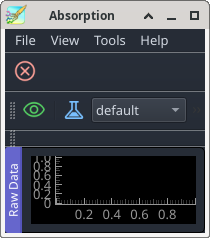
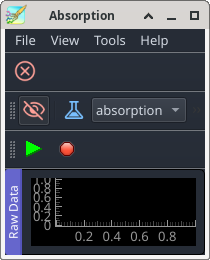
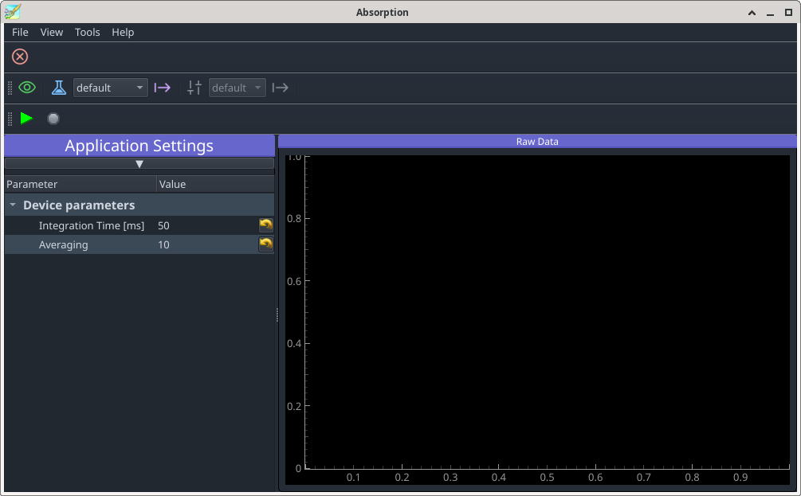

Extension Plugin
================

In a first step we have to modify the file :file:`pyproject.toml` in the module's root directory to tell PyMoDAQ that this module also contains an extension.

.. code-block::
   :emphasize-lines: 3

    [features]
    instruments = true
    extensions = true
    models = false
    ...

Next we have to get to the extension folder :file:`src/pymodaq_plugins_tutorial_extension/extensions`
and rename the extension template in the extension folder, giving it a meaningful name.

.. code-block::

   .../extension$ git mv custom_extension_template.py absorption_extension.py

Now load the renamed file and adapt the names close to the top of the file according to the instructions given in the comments inside the file. Following the initial import declarations, the top of the file should afterwards look like this

.. code-block::

    ...
    from pymodaq_plugins_tutorial_extension.utils import Config as PluginConfig

    logger = set_logger(get_module_name(__file__))

    main_config = Config()
    plugin_config = PluginConfig()

    EXTENSION_NAME = 'Absorption'
    CLASS_NAME = 'Absorption'

    class Absorption(CustomExt):
    ...

The initialisation of the instance of the absorption extension can be left untouched for now.

.. code-block::

    class Absorption(CustomExt):
    ...
        def __init__(self, parent: gutils.DockArea, dashboard):
            super().__init__(parent, dashboard)
            self.setup_ui()

Note that though the method :code:`setup_ui` needs to be called in any custom extension, this is not done in the inherited classes' initialisation. The aim is to permit setting up some matter which is needed to initialise its UI but needs in turn the parent class already to be initialised.

The main GUI area of the application is accessible through the instance variable :code:`self.dockarea`. Any widgets can be added there via instances of :code:`Dock`. The following code creates the display for the current measurement. It should be pretty self explaining.

.. code-block::

    from pymodaq_gui.utils.dock import Dock, DockLabel
    from pymodaq_gui.plotting.data_viewers.viewer1D import Viewer1D
    ...
    class Absorption(CustomExt):
    ...
        def setup_docks(self):
            self.create_dashboard_toolbar()

            self.spectrum_label = DockLabel("Raw Data")
            spectrum_dock = Dock('Data', label=self.spectrum_label)
            self.docks['spectrum'] = self.dockarea.addDock(spectrum_dock)
            spectrum_widget = QtWidgets.QWidget()
            self.spectrum_viewer = Viewer1D(spectrum_widget)
            self.spectrum_viewer.toolbar.hide()
            spectrum_dock.addWidget(spectrum_widget)

To be able to test the newly constructed GUI, two methods populated later have to be temporarily disabled.

.. code-block::
   :emphasize-lines: 4,8

    class Absorption(CustomExt):
    ...
        def setup_actions(self):
            return
            """Method where to create actions to be subclassed. Mandatory"""
    ...
        def connect_things(self):
            return
            """Connect actions and/or other widgets signal to methods"""

To make PyMoDAQ aware of the newly created extension we have to re-install the package in ediatble mode which has to be done in the root directory of the package::

  $ cd /path/to/extension-plugin-code/pymodaq_plugins_tutorial_extension
  $ pip install -e .

The dashboard may now be launched. The command line switch -x tells PyMoDAQ to directly load the indicated experiment configuration.

.. code-block::

   $ dashboard -x absorption

The list of extensions should contain an entry "Absorption". After starting it, a window should pop up which looks like the following

However, it hasn't got any functionality yet. In case that our newly created extension doesn't show up in the list, most likely some typo or messed up indentation prevents the module from being loaded. To check that, you may run the extension code directly::

  $ cd src/pymodaq_plugins_tutorial_extension/extensions
  $ python absorption_extension.py

If python throws any error at you, that message should tell where the problem is. In case of success, the bare extension window should pop up. Another source of information can be the log file which you may scan for error messages.

:code:`tag bare-extension`

To get things working in a preliminary and primitive fashion we add a method that accepts data from the spectrograph's 1D viewer plugin. It simply extracts the raw spectrometer data from the received :code:`DataToExport` object and displays that in the viewer.

.. code-block::

    from pymodaq.utils.data import DataToExport
    ...
    class Absorption(CustomExt):
    ...
        def take_data(self, data: DataToExport):
            spectro_data = data.get_data_from_dim('Data1D')[0]
            self.spectrum_viewer.show_data(spectro_data)

Note that this assumes that the data received from the plugin contains a set of one dimensional data and that the first (or only) one dimensional array therein contains the intensity data from the spectrometer. This is where we may hit the limits for creating a generic application. A plugin written by someone alse and delivering its data in a different form may not be working here. :code:`DataToExport` comes with quite a list of methods which permit to extract contained data identified by names and labels. Having a general spectrometer application in mind, one may want to retrieve first a data set, analyse its content and give the user the choice what data item should be taken. However and for the time being, we know what's in there and can just go on.

Once the dashboard has been loaded with the experiment, the devices defined in the experiment can be registered with the modules manager. This allows to obtain a reference to the detector which can be connected to the data display. The mechanism behind the scene is that once the method :code:`self.detector.grab()` is called, PyMoDAQ quests acquisition on the device in a loop. For each retrieved data item the plugin emits the signal :code:`grab_done_signal` which we have to connect to the extension's method :code:`take_data`.

.. code-block::

    from pymodaq.utils.data import DataToExport, Axis
    from pymodaq.utils.managers.modules.utils import ModuleType
    ...
    class Absorption(CustomExt):
    ...
        def do_things_after_experiment_set(self, experiment_name: str):
            self.modules_manager.detectors_all = \
                self.dashboard.modules_manager.detectors_all

            self.detector = \
                self.modules_manager.get_mod_from_name('Spectrometer',
                                                       ModuleType.Detector)
            self.detector.grab_done_signal.connect(self.take_data)
            self.x_axis = \
                Axis(label='Wavelength', units='nm',
                     data=self.detector.controller.wavelengths, index=0)

Note that there's an issue here how to identify the device of choice. :code:`ModulesManager.get_mod_from_name` needs to get the name  exactly as we have defined it in the experiment. However, how should a non-developping user know what to enter there, unless having been specificly instructed? We'll cover that later with an appropriated configuration dialog. For now, we'll have to pay attention that the two names match exactly.

Two methods take care of starting and ending the acquisition.

.. code-block::

    class Absorption(CustomExt):
    ...
        def start_acquiring(self):
            self.detector.grab()

        def stop_acquiring(self):
            self.detector.stop_grab()

To make them accessible from the GUI, two methods predefined in the template which we had deactivated before have to be populated.

.. code-block::
   :emphasize-lines: 2-5,8-

    def setup_actions(self):
        self.add_action('acquire', 'Acquire', 'run2',
                        "Acquire", checkable=False, toolbar=self.toolbar)
        self.add_action('stop', 'Stop', 'stop2',
                        "Stop", checkable=False, toolbar=self.toolbar)

    def connect_things(self):
        self.connect_action('acquire', self.start_acquiring)
        self.connect_action('stop', self.stop_acquiring)

The extension has now a second tool bar from which the acquistion can be started and stopped.

When you start the acquistion, the extension does nothing more than what is already happening in the panel named "Spectrometer MockSpectro" in the dashboard.

Stopping acquisition before it has been started doesn't make much sense. PyMoDAQ still handles the situation correctly. However, necessary actions unknown to PyMoDAQ may not do so. It is therefore better to activate only those actions which actually make sense.

.. code-block::
   :emphasize-lines: 6,7,12-

    def setup_actions(self):
        ...
        self._actions["stop"].setEnabled(False)

    def start_acquiring(self):
        self._actions["acquire"].setEnabled(False)
        self._actions["stop"].setEnabled(True)
        self.detector.grab()

    def stop_acquiring(self):
        self.detector.stop_grab()
        self._actions["acquire"].setEnabled(True)
        self._actions["stop"].setEnabled(False)

Note that this introduces a bug. The dasboard is of course not aware of the functionality created in the extension. When starting or stopping the acquisition from the dashboard, the tool bar buttons in the extension are not updated. Again, this will be addressed later on.

:code:`tag extension-with-data`

You may have noticed while playing around with the extension that it opens up with a size which is not very suitable. And changes to the window are not preserved over quitting the dashboard. Let's make changes so that the GUI geometry stays permanently. Two functions, inverse of each other, take care of writing the current parameter values and geometry settings to a configuration file and reading them back. This is done here in a preliminary fashion using Qt's settings mechanism. **@PyMoDAQxperts:** please replace this with more PyMoDAQonian style ...

.. code-block::

    def write_settings(self, qt_settings):
        qt_settings.setValue("geometry", self.mainwindow.saveGeometry())
        qt_settings.setValue("dockarea", self.dockarea.saveState())

   def read_settings(self, qt_settings):
        geometry = self.qt_settings.value("geometry", QByteArray())
        self.mainwindow.restoreGeometry(geometry)
        state = self.qt_settings.value("dockarea", None)
        if state is not None:
            try:
                self.dockarea.restoreState(state)
            except: # pyqtgraph's state restoring is not very fail safe
                # erease inconsistent settings in case pyqtgraph trips
                self.qt_settings.setValue("dockarea", None)

To make this work, the two functions have to be hooked up into the initialisation and shut down procedures.

.. code-block::
   :emphasize-lines: 1,2,7-10,12-

    from qtpy.QtCore import QSettings, QByteArray
    from pymodaq_utils.config import Config, ConfigError, get_set_config_dir
    ...
    def __init__(self, parent: gutils.DockArea, dashboard):
        ...
        self.setup_ui()
        config_dir = get_set_config_dir("gui-state", user=True)
        settings_file_name = f'{config_dir}/{EXTENSION_NAME}.conf'
        self.qt_settings = QSettings(settings_file_name, QSettings.NativeFormat)
        self.read_settings(self.qt_settings)

    def quit_fun(self):
        self.write_settings(self.qt_settings)

The first of the newly introduced lines in the init method returns a path to a subfolder :file:`gui-state` located in the user's PyMoDAQ configuration folder. If that subfolder doesn't exist yet it is created. GUI settings can go in there now. Have a try, resizing the extension window should now persist over shutting down and restarting the extension and the dashboard. Note that this geometry sub-section may not be necessary in future versions of PyMoDAQ. An ongoing pull request may incorporate the feature into the custom app base class.

:code:`tag geometry`

The paramaters controlling the spectrometer are all accessible in the experiment configuration and could be changed via the detector's widget in the dashboard, or using the configurator (try this out yourself as an exercice). However, to ease operation, a set of most important parameters shall be displayed in the main window of the spectrometer application. They are declared in the preamble of the extension class in the same fashion as device parameters in the preamble of a plugin class. All parameters defined in :code:`params[]` are made avaliable in :code:`self.settings_tree` by PyMoDAQ's start-up machinery.

.. code-block::
   :emphasize-lines: 3-14,19-21,25-

    class Absorption(CustomExt):
        ...
        params = [
            {'name': 'device_params', 'title': 'Device parameters', 'type': 'group',
             'children': [
                 {'name': 'integration_time', 'title': 'Integration Time [ms]',
                  'type': 'float', 'min': 0.001, 'max': 10000, 'value': 50,
                  'tip': 'Integration time in seconds'},
                 {'name': 'averaging', 'title': 'Averaging',
                  'type': 'int', 'min': 1, 'max': 1000, 'value': 10,
                  'tip': 'Software Averaging'},
               ]
             },
           ]
        ...
        def setup_docks(self):
            self.create_dashboard_toolbar()

            self.docks['settings'] = Dock('Application Settings')
            self.dockarea.addDock(self.docks['settings'])
            self.docks['settings'].addWidget(self.settings_tree)

            self.spectrum_label = DockLabel("Raw Data")
            spectrum_dock = Dock('Data', label=self.spectrum_label)
            self.docks['spectrum'] = \
                self.dockarea.addDock(spectrum_dock, "right",
                                      self.docks['settings'])

The newly introduced dock holds a parameter tree containing what has been defined in :code:`params`. Note the change in placing the data viewer at the right of the parameter dock. To make the detector aware of parameter changes, another predefined method has to be populated

.. code-block::
   :emphasize-lines: 4-

    class Absorption(CustomExt):
    ...
        def value_changed(self, param):
            if param.name() == "integration_time":
                self.detector.settings.child('detector_settings',
                                             'integration_time') \
                                      .setValue(param.value())

To prevent the contents of an obsolete configuration file messing up the layout, remove the file in question

.. code-block::

   $ rm ~/.pymodaq/gui-state/Absorption.conf

The Absorption extension should now look like

The parameter ``Average`` has not yet any effect. Let's change that. 

.. code-block::
   :emphasize-lines: 1,3,8,9,13-28,30-

    import numpy as np
    ...
    from pymodaq.utils.data import DataToExport, DataFromPlugins, Axis
    ...
    class Absorption(CustomExt):
        ...
        def start_acquiring(self):
            self.n_samples = 0
            self.n_average = self.settings.child('device_params')['averaging']
            ...
        def take_data(self, data: DataToExport):
            spectro_data = data.get_data_from_dim('Data1D')[0]
            self.n_samples = self.accumulate_data(spectro_data[0], self.n_samples)
            if self.n_samples < self.n_average:
                return

            if self.n_average < 2:
                self.spectrum_viewer.show_data(spectro_data)
                return

            self.mean_current, self.error_current = \
                self.average_data(self.sum_data, self.squares_data, self.n_samples)
            self.n_samples = 0
            dfp = DataFromPlugins(name='current',
                                  data=[self.mean_current, self.error_current],
                                  dim='Data1D', labels=['current', 'error'],
                                  axes=[self.x_axis])
            self.spectrum_viewer.show_data(dfp)
        ...
        def accumulate_data(self, data, n_samples):
            if n_samples:
                self.sum_data += data
                self.squares_data += data**2
            else:
                self.sum_data = data
                self.squares_data = data**2
            return n_samples + 1

        def average_data(self, sum_data, squares_data, n_samples):
            mean = sum_data / n_samples
            error = np.sqrt((n_samples * squares_data - sum_data**2)
                            / (n_samples**2 * (n_samples - 1)))
            return mean, error

Zooming in on the error curve permits to see how the error scales now with :math:`\sqrt{n_\mathrm{average}}`.

:code:`tag averaging`

Once again, changes on the parameters do not survive quitting. One could write them to and recover them from a config file one by one. However, expecting the number of parameters to increase with time, it will be advantageous to prepare for that now. Since the device params are a dict inside a dict inside an array, it is easier to declare them in a separate list 

.. code-block::
   :emphasize-lines: 3-15,21-23,27-

    class Absorption(CustomExt):

        device_params = [
            {'name': 'integration_time', 'title': 'Integration Time [ms]',
             'type': 'float', 'min': 0.001, 'max': 10000, 'value': 50,
             'tip': 'Integration time in seconds'},
            {'name': 'averaging', 'title': 'Averaging',
             'type': 'int', 'min': 1, 'max': 1000, 'value': 10,
             'tip': 'Software Averaging'},
            ]

        params = [
            {'name': 'device_params', 'title': 'Device parameters', 'type': 'group',
             'children': device_params },
            ]

    ...
 
        def write_settings(self, qt_settings):
            ...
            for param in self.device_params:
                qt_settings.setValue(name,
                                     self.settings.child('device_params') \
                                     [param['name']])

        def read_settings(self, qt_settings):
            ...
            for param in self.device_params:
                self.settings.child('device_params')[param['name']] = \
                    qt_settings.value(param['name'], param['value'])
                                     

The second argument of :code:`QSettings.value` is a default value which prevents a :code:`None` value being inserted when the entry asked for is not present in the configuration file, which would cause an exception to be raised.

Until now, the extension still does nothing more than a bare plugin can do. Features beyond will be introduced in the next chapter.

:code:`tag params-to-settings`
