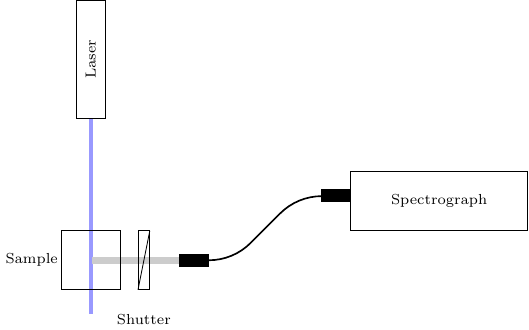

Fluorescence measurements, work in progress
===========================================

We add now a laser which may excite the sample. It passes through the sample cuvette at a right angle with respect to the path of the whitelight of the lamp to minimise scattering. However, during this experiment, the latter will remain switched off. Such arrangement can be used to measure a fluorescence spectrum. The laser shall be controlled by another binary DAQ_move like the shutter.

.. code-block::
   :emphasize-lines: 4

    class MockSpectrograph:
        ...
	absorption: float = 0.3
	shutter_names = ['dark', 'excitation']

    ...

	def calculate_base_data(self):
	    ...
	    self.luminescence_spectrum = \
		np.exp(-((self.pixels - 3 * n_pix / 4) / (n_pix / 3))**2)

	def set_shutter_value(self, axis, value):
	    if axis == 'excitation' and value != self.shutter[axis].get_value():
		if value == 1:
		    self.on_since = time.time()
		else:
		    self.accumulated_on += time.time() - self.on_since
	    self.shutter[axis].move_at(value)

	@property
	def absorption(self):
	    return self._absorption * np.exp(-self.accumulated_on * self.rate)
