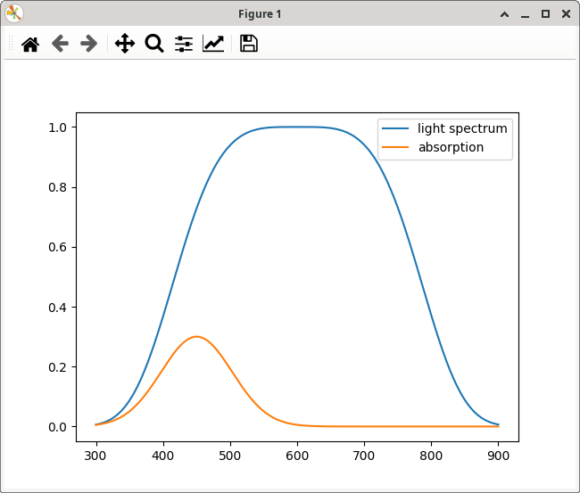
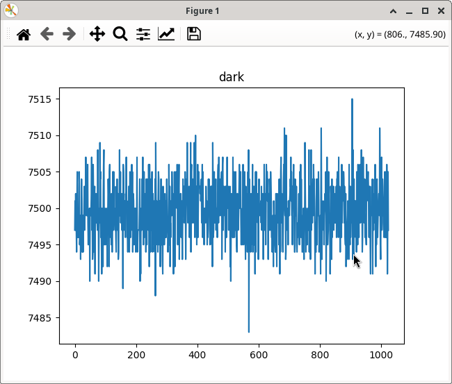
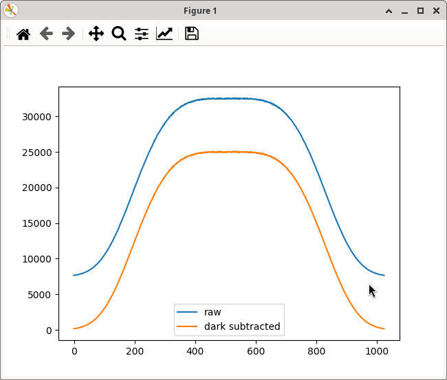
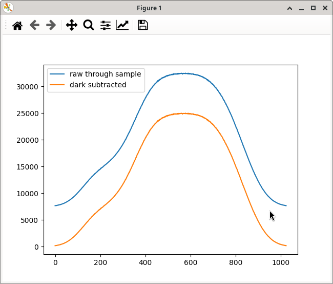
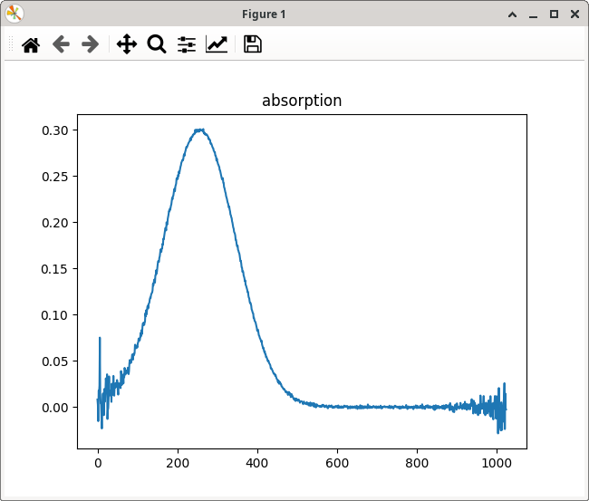

Simulating a spectro-photometer
===============================

Let us start this section with a brief comment to simulating devices. Simulating things is a useful starting point here because we avoid communication issues with real devices at this point. On top of that, no hardware is needed and the development can take place anywhere where an internet connection is available (the latter for installing missing stuff and searching for help when it doesn't-doesn't). However, it can be very useful to keep simulation capabilities in place even when everything works with real hardware.

* There might be only a single and expensive device around and your colleagues are using it at present for a longer measurement campain. With a simulated device you may happily continue coding.
* Suppose that the experiment has a surprising result. Being able not only to simulate some default values but the outcome of an entire experiment while using the whole chain from the simulated device over PyMoDAQ's functionality to data treatment software on the obtained data may be a very helpful quality control. Is the result surprising because a mistake happended during the experiment? during data acquision? during treatment? *or did we actually discover something new??*
* You may learn a lot about your experiment and its instrumentation by making sure that at the tail of the chain you are actually getting back exactly what you have put into the simulation at its head. Remember that the only way a sample can talk to you in a spectroscopic experiment is by means of signal photons it emits. These and the carried information pass by a multitude of optical elements, detectors, ADC converters, data treatment of all sorts etc. Quite some Chinese whispers to master.

controller

.. code-block:: python

  import numpy as np
  from dataclasses import dataclass

  @dataclass
  class MockSpectrograph:

      integration_time: float = 50
      n_pixels: int = 1024
      readout_noise: int = 4
      dark_level: float = 150
      light_level: float = 500
      pe_per_lsb: float = 18.3
      adc_bits: int = 16
      wl_from: float = 300
      wl_to: float = 900
      absorption: float = 0.3

      def __post_init__(self):
	  self.calculate_base_data()

      def calculate_base_data(self):
	  n_pix = self.n_pixels
	  self.wavelengths = \
	      np.linspace(self.wl_from, self.wl_to, n_pix)
	  self.pixels = np.linspace(0, n_pix - 1, n_pix)
	  self.spectrum = \
	      np.exp(-((self.pixels - n_pix / 2) / (n_pix / 3))**4)
	  self.absorption = \
	      self.absorption \
	      * np.exp(-((self.pixels - n_pix / 4) / (n_pix / 8))**2)

testing

.. code-block:: python

  if __name__ == '__main__':
      import matplotlib.pyplot as plt
      spectrograph = MockSpectrograph()

      plt.plot(spectrograph.wavelengths, spectrograph.spectrum)
      plt.plot(spectrograph.wavelengths, spectrograph.absorption)
      plt.legend(['light spectrum', 'absorption'])
      plt.show()

background

.. code-block:: python

    def simulate_spectrum(self, shutter_open: bool, sample: bool):
        data = np.random.normal(loc=self.dark_level * self.integration_time,
                                scale=self.readout_noise, size=self.n_pixels)
        max_adc = 1 << self.adc_bits
        data = np.where(data < max_adc, np.floor(data), max_adc)

        return data, time.time()

reference

.. code-block:: python
   :emphasize-lines: 4,5,6,7

    def simulate_spectrum(self, shutter_open: bool, sample: bool):
        data = np.random.normal(loc=self.dark_level * self.integration_time,
                                scale=self.readout_noise, size=self.n_pixels)
        if shutter_open:
            light = self.spectrum * self.light_level * self.integration_time \
                * self.pe_per_lsb
            data += np.random.poisson(light) / self.pe_per_lsb
        max_adc = 1 << self.adc_bits
        data = np.where(data < max_adc, np.floor(data), max_adc)

        return data, time.time()

absorption

.. code-block:: python

    def simulate_spectrum(self, shutter_open: bool, sample: bool):
        data = np.random.normal(loc=self.dark_level * self.integration_time,
                                scale=self.readout_noise, size=self.n_pixels)
        if shutter_open:
            light = self.spectrum * self.light_level * self.integration_time \
                * self.pe_per_lsb
            if sample:
                light *= np.pow(10, -self.absorption)
            data += np.random.poisson(light) / self.pe_per_lsb
        max_adc = 1 << self.adc_bits
        data = np.where(data < max_adc, np.floor(data), max_adc)

        return data, time.time()

