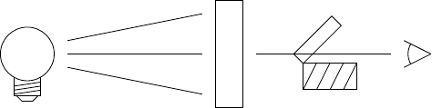

Introduction
============

This tutorial guides through the coding of a measurement application in form of a PyMoDAQ dashboard extension. It covers mainly advanced material, but still start a step by step from scratch. The reader should be familar with the use of PyMoDAQ, its dashboard and the standard extensions like the DAQ scan or the data logger. Knowing how to programm in Python is also helpful.

The tutorial does not rely on any special hardware (besides a computer). All instrumental aspects are simulated. The experiment in its base version consists of a whitelight lamp, a sample cuvette, a shutter and a spectro-photometer. The shutter is used to record the dark signal of the photometer's detector.

Later on, the experiment will be extended to record the course of a photochemical reaction by measuring a series of absorption spectra as a function of time.
