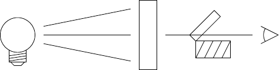

Introduction
============

This tutorial guides through the coding of a measurement application in form of a PyMoDAQ dashboard extension. It covers mainly advanced material beyond writing instrument plugins, but still starting step by step from scratch. The reader should be familar with the use of PyMoDAQ, its dashboard and the standard extensions like the DAQ scan or the data logger. Knowing how to programm in Python is also pretty helpful. The tutorial does not rely on any special hardware (besides a computer). All instrumental aspects are simulated.

The simulated experiment
........................

The simulated experiment used for this tutorial involves measuring the absorption of a liquid sample solution in a spctroscopy cell. Let's assume that we have dissolved a dye in some solvent. The dye molecules absorb light aroud a certain wavelength. The aim of the experiment is to determine the corresonding absorption spectrum. The intensity of the light transmitted to through the sample, :math:`I_\mathrm{trans}`, is given by Beer-Lambert's law

.. math::
   I_\mathrm{trans} = I_0 10^{-\varepsilon cl}

where :math:`I_0` is the incident intensity, :math:`\varepsilon` the molar extinction coefficient of the dissolved dye molecules, :math:`c` their concentration and :math:`l` the length of the optical path in the sample cell. The absorption of interest is then given by

.. math::
   :name: absorption

   A(\lambda) = -\log_{10}\frac{I(\lambda)}{I_0(\lambda)}
   = \varepsilon c(\lambda)l.

The detector of the spectro-photometer used to record the intensity of the transmitted light as a function of wavelength exhibits a certain thermally induced dark signal which has to be subtracted from the obtained signal. In consequence, this signal has to be determined beforehand by closing a shutter in front of the entrance of the spectro-phhotometer and recording the signal with no incident light. Therefore, the experiment in its base version consists of a whitelight lamp, a sample cuvette, a shutter and a spectro-photometer.

In a second step, the incident light intensity has to be determined. At the same time, the effect of reflections and scatter on the surfaces of the sample cell and in the solvent, which induce some additional, featureless absorption, can be taken into account. To this end, the sample cell is filled with solvent only, and the transmitted light intensity is recorded as reference :math:`I_0(\lambda)`. To measure the absorption, the cell containing the dye solution is inserted and the recorded data is treated according to eq. :eq:`absorption`.

In later chapters, the experiment will be extended to measure fluoresence spectra and finally to record the course of a photochemical reaction by measuring a series of absorption spectra as a function of time. But first things first.

What wa are going to code
.........................

To interface and operate experiment described in the previous section we'll need to control the spectro-photometer and the shutter. This involves writing a PyMoDAQ plugin for each of these devices. Controlling the flow of the experiment, i.e. measuring first the dark, then the incident intensity and finally the absorption, is the job of the extension to be written.

PyMoDAQ's device plugins provide already a direct and graphical access to the controlled device, which permits to test and explore the functionality of the device on its own. Some standard measurement procures like acquiring a value or a spectrum at regular intervals in time or as a function of a position, an angle, a temperature or whatever parameter to be scanned, can be achieved by the extensions aready built into PyMoDAQ. More specialised work flows, like the one addressed here, have to be implemented in a custom extension.

Technically speaking, the Python class :code:`CustomExtension` inherits from the class :code:`CustomApplication`. Besides coordinating devices controlled by the dashboard, a custom extension also comes with its own graphical user interface. It is therefore possible to expose only those parameters, actions and acquired or processed data to the user which are essential for the flow of the experiment in daily operation.

How to use this tutorial
........................

When working through the following chapters, you will encouter here and there some Python features which are not covered in this tutorial, like the concept of classes and instances and their corresponding variables, decorators, lambdas etc, just to name some. These are Python pecularities but not specific to PyMoDAQ. Should you get stuck on one those, ask uncle stackoverflow, aunty google and colleague chatbot. That will also help you getting familiar with these tools and developping your own productive style of coding. There are plenty of excellent tutorials on such matter out there. And keep in mind, also on the `PyMoDAQ website <https://pymodaq.cnrs.fr>`_ you'll find quite some useful guides and tutorials how to juggle with PyMoDAQ and its built-in functionalities.

    When typing `h` followed by enter into the `TeX` command line three times in a row, good old Donald Knuth tells you: *Maybe you should try asking a human? [...] If all else fails, read the instructions.* That's probably still a good idea.
