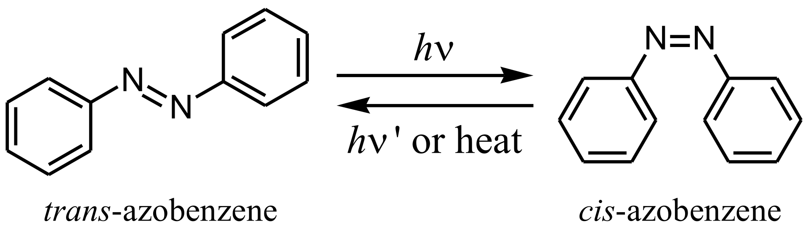
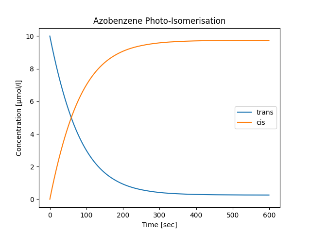
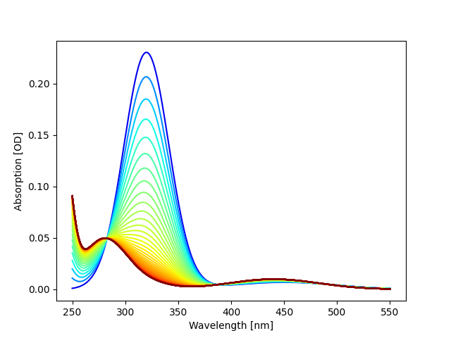

Work in Progress Watching a photochemical reaction
==================================================

Description and simulation of the experiment
--------------------------------------------

In this chapter the experiment is extended to be able to monitor a photo-isomerisation reaction. Let's take azobenze as an example. It can exisit in two isomers, in trans and in cis form.

The trans isomer is thermally more stable. Therefore, when left long enough in the dark, all molecules turn into the trans form. Upon illumination with blue light, a fraction undergoes an isomerisation to the cis form. The cis to trans back reaction is thermally activated with a rate of roughly :math:`10^{-6}`/s at room temperature. However, the back reaction can also take place after photo-excitation of the cis form.

The rate of the trans-cis isomerisation is proportional to the intensity of the excitation light. However, due to the absorption of the sample, the intensity decreases along the optical path. And since the concentration changes during  the course of the reaction, so does the absorption.
Therefore, the overall description of the concentrations takes the form of a nonlinear, ordinary differential equation. The number of photons absorbed in the sample of length :math:`L` in a short time, :math:`dt`, is given by Beer-Lambert's law

.. math::

   dn_\mathrm{ph}
   = \frac{I_0}{h\nu}
      \left[1
            - 10^{-\left(\varepsilon_\mathrm{trans}c_\mathrm{trans} +
                         \varepsilon_\mathrm{cis}c_\mathrm{cis}\right)L}\right]
      dt

where :math:`I_0` is the incident intensity of the excitation light and :math:`h\nu` its energy per photon. :math:`\varepsilon_\mathrm x` and :math:`c_\mathrm x` are the (decadic) molar extiction coefficients and the concentrations of the two species. We can separate this into the number of photons absorbed by each species individually

 .. math::

    dn_\mathrm{ph,trans}
    &= \frac{I_0}{h\nu}
       \left[1 - 10^{-\alpha_\mathrm{tot}L}\right]
       \frac{\alpha_\mathrm{trans}}{\alpha_\mathrm{tot}}dt \\
    dn_\mathrm{ph,cis} &= dn_\mathrm{ph} - dn_\mathrm{trans}.

:math:`\alpha_\mathrm x` denotes here the absorption per length :math:`\varepsilon_\mathrm x c_\mathrm x` with :math:`x=(\mathrm{trans,cis})` and :math:`\alpha_\mathrm{tot}=\alpha_\mathrm{trans} + \alpha_\mathrm{cis}`. After photo excitation of the trans isomer, a certain fraction :math:`\Phi_\mathrm{t-c}` undergoes isomerisation to the cis form while the remainder returns to the ground state of the trans form. Likewise, a cis isomer may undergo a photo-induced cis-trans isomerisation with a quantum yield of :math:`\Phi_\mathrm{c-t}`.
The total balance of molecules in trans form is therefore given by

.. math::

   \dot n_{trans}
   = N_\mathrm A V\cdot \dot c_\mathrm{trans}
   = -\Phi_\mathrm{t-c}\dot n_\mathrm{ph,trans}
     +\Phi_\mathrm{c-t}\dot n_\mathrm{ph,cis}
     + N_\mathrm A V\cdot k_\mathrm{cis-trans}c_\mathrm{cis}

where :math:`k_\mathrm{cis-trans}` is the rate of the thermally activated back reaction, :math:`N_\mathrm A` Avogadro's constant and :math:`V` the total sample volume, illuminated and non illuminated. In terms of the concentration of trans isomer this reads

.. math::

   \dot c_\mathrm{trans}
   = \frac{I_0}{h\nu N_\mathrm AV}
     \left[1 - 10^{-\alpha_\mathrm{tot}L}\right]
     \frac{- \Phi_\mathrm{t-c}\alpha_\mathrm{trans}
           + \Phi_\mathrm{c-t}\alpha_\mathrm{cis}}
          {\alpha_\mathrm{tot}}
     + k_\mathrm{cis-trans}c_\mathrm{cis}

This equation has to be solved numerically. The concentration of the cis isomer is then simply given by the balance

.. math::
   c_\mathrm{cis} = c_\mathrm{tot} - c_\mathrm{trans}.

Using the values

.. csv-table::
   :align: center

   ":math:`\varepsilon_\mathrm{trans}`", "23000 M :math:`^{-1}` cm :math:`^{-1}`"
   ":math:`\varepsilon_\mathrm{cis}`",   "1000 M :math:`^{-1}` cm :math:`^{-1}`"
   ":math:`\Phi_\mathrm{t-c}`",          "0.5"
   ":math:`\Phi_\mathrm{c-t}`",          "0.3"
   ":math:`k_\mathrm{cis-trans}`",       ":math:`10^{-6}`/s"
   "excitation wavelength, :math:`h\nu`","325 nm, :math:`6.22\cdot10^{-19}` J"
   "power of excitation light",          "40 µW"
   ":math:`L`",                          "1 cm"
   ":math:`V`",                          "2 ml"
   ":math:`c_\mathrm{trans}(t=0)`",      "10 µmol/l"

the simulation of the kinetics gives the following result

We realise that the back reaction in the dark does not influence the speed of the light-induced forward reaction. the following graphic shows the corresponding absorption spectra with a stepping of 10 seconds.

   Absorption of 10 µmol/l of azobenzene in methanol when exposed to
   light of a wavelength of 325 nm. 

Adapting the simulation in the PyMoDAQ controller
-------------------------------------------------

Timing introduced into the controller
-------------------------------------

Improved experimental procedure
-------------------------------

If you've got the possibility to perform the experiment in a real lab, you'll notice that the observed kinetics are quite faster than what the simulation tells. Why is that? Simply because the whitelight used for recording the absorption drives the photo-induced isomerisation as well. To avoid this problem, the exposure of the sample to probe light has to be minimised. However, simply lowering its intensity does not help much because the signal-to-noise ratio of the obtained absorption spectrum degrades with diminished light intensity. It is better to i) insert a shutter between lamp and sample which is open only during absorption measurements and ii) to adapt the measurement sequence to shape of the kinetics. The concentrations change rapidly at short times and slow down as time goes on. At later times it is sufficient to record spectra only now and then. In other words, the time grid for recording absorption spectra should have a logarithmic spacing. More precisely and since the recording time is not infinitely short, the measurement sequence should start with linearly spaced time steps until a certain limit and then continue logarithmically.

Improved experimental set-up
----------------------------

The following sketch shows the extension of the previously used arrangement. Using two Y-fibres, the whitelight light from the lamp can be monitored without changing the cuvette.

.. image:: sketch-photochem.png

This permits to correct for drifts of the lamp spectrum over the course of the experiment. However, it doesn't permit to automatically take a reference of the lamp spectrum :math:`R` because the two beam paths are not identic. :math:`R` has still to be recorded by manually inserting a pure sample solvent at the begin of the experiment. :math:`I_0`, the incident intensity monitored through the additional beam path, has to be recorded previous to the experiment as well. During the experiment and when needed, the shutters can be switched such that :math:`I_0^\prime`, the incident intensity during the experiment, can be re-measured. Without drifts one should have :math:`I_0^\prime=I_0`. The corrected absorption is then given by

.. math::
   A(\lambda) = -\log_{10}\left(\frac S{I^\prime}\cdot\frac{I_0}R\right).

The idea is to introduce a parameter defining the time span after which the loop recording absorption spectra has to be temporally left to record a renewed lamp spectum. Of course, we could implement all this into the controller since the only 'feedback' needed here is the time stamp from the recorded spectrum which tells when renewing the lamp spectrum is due. However, any other 'decision maker' would be hard to implement within the controller without breaking PyMoDAQ's modular design. Futhermore, a simple exchange of the spectro-photometer from model XYZ to model :math:`\alpha\beta\gamma` would ask for re-implementing all the same in the corresponding controller. Certainly, a Python mixin could ease that. However, it would still introduce modularity at other places than forseen by PyMoDAQ. It is time to address the sequencer.
