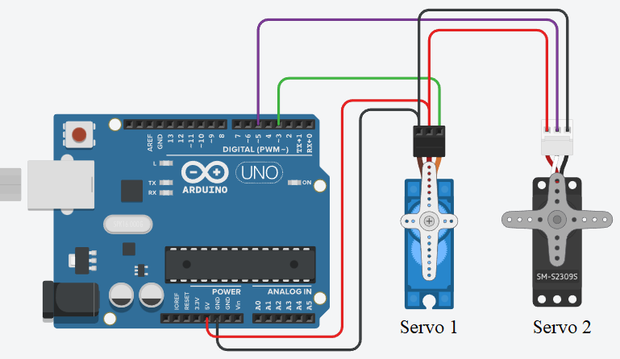
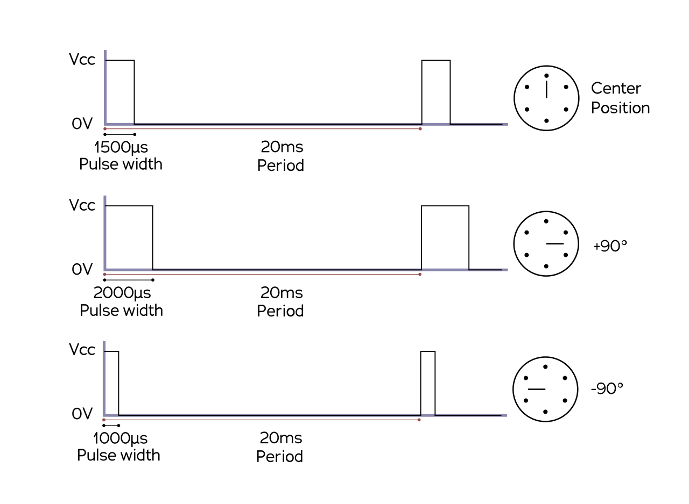

Shutter plugin
==============

The shutter used in this experiment is a low-cost device based on a pulse-width modulation (PWM) driven servo for modeling controlled by an arduino board. An anodised blade is fixed to the servors steerer an blocks the light beam when moved to the correct position

The position is controllel by the duty cycle of a pulsed signal, typically with a period of 20ms. The width of the pulse controls the position / angle.

The only thing which matters in the context of this tutorial is that the corresponding actuator plugin has to switch the (here simulated) servo between two values for shutter on closed and shutter on opened position, respectively.

.. code-block::

    class MockActuator:

	def __init__(self, current=0):
	    self._target_value = current
	    self._current_value = current

	def move_at(self, value):
	    self._target_value = value
	    self._current_value = value

	def get_value(self):
	    return self._current_value

    class MockShutter(MockActuator):

	pass

.. code-block::
   :emphasize-lines: 14,18-

    @dataclass
    class MockSpectrograph:

	integration_time: float = 50
	n_pixels: int = 1024
	readout_noise: int = 4
	dark_level: float = 150
	light_level: float = 500
	pe_per_lsb: float = 18.3
	adc_bits: int = 16
	wl_from: float = 300
	wl_to: float = 900
	absorption: float = 0.3
	shutter_names = ['dark']

        def __post_init__(self):
	    self.calculate_base_data()
	    self.with_sample = True
	    self.shutter = { name: MockShutter(1200)
	                     for name in self.shutter_names }

.. code-block::

    class MockSpectrograph:

    ...

	def grab_spectrum(self):
	    time.sleep(max(self.integration_time * 1e-6, 0.001))
	    #return self.simulate_spectrum(self.get_shutter_value('dark') > 1000,
	    #                              self.with_sample)
	    return self.simulate_spectrum(self.get_shutter_value('dark') > 0,
					  self.with_sample)

	def get_shutter_value(self, axis):
	    return self.shutter[axis].get_value()

	def set_shutter_value(self, axis, value):
	    return self.shutter[axis].move_at(value)

.. code-block::

   .../daq_move_plugins$ git mv daq_move_Template.py daq_move_MockShutter.py

.. code-block::

    class DAQ_Move_MockShutter(DAQ_Move_base):

        is_multiaxes = True
	_axis_names = MockSpectrograph.shutter_names[:2]
	_controller_units = '' #: Union[str, List[str]] = ['mm', 'mm']
	_epsilon = 0.1
	data_actuator_type = DataActuatorType.DataActuator

	params = [
	] + comon_parameters_fun(is_multiaxes, _axis_names, epsilon=_epsilon)

	def ini_attributes(self):
	    self.controller: MockSpectrometer = None

.. code-block::

    class DAQ_Move_MockShutter(DAQ_Move_base):

        ...

        def ini_stage(self, controller=None):
	    if self.is_master:
		self.controller = MockSpectrograph()
	    else:
		self.controller = controller

	    info = "Mock polarizer line initialised"
	    return info, True

	def close(self):
	    pass

	def commit_settings(self, param: Parameter):
	    pass

.. code-block::

    class DAQ_Move_MockShutter(DAQ_Move_base):

        ...

	def get_actuator_value(self):
	    axis = self.settings['multiaxes', 'axis']
	    pos = DataActuator(data=self.controller.get_shutter_value(axis),
			       units=self.axis_unit)
	    pos = self.get_position_with_scaling(pos)
	    return pos

	def move_abs(self, value: DataActuator):
	    value = self.check_bound(value)
	    self.target_value = value
	    value = self.set_position_with_scaling(value)
	    axis = self.settings['multiaxes', 'axis']
	    self.controller.set_shutter_value(axis, value.value(self.axis_unit))
	    self.emit_status(ThreadCommand('Update_Status',
					   ['Moved shutter %s' % axis]))

	def move_rel(self, value: DataActuator):
	    axis = self.settings['multiaxes', 'axis']
            self.move_abs(self.get_actuator_value(axis) + value)

	def move_home(self):
	    self.emit_status(ThreadCommand('Update_Status',
					   ['Move Home not implemented']))

	def stop_motion(self):
	    self.move_done()

    if __name__ == '__main__':
	main(__file__)
