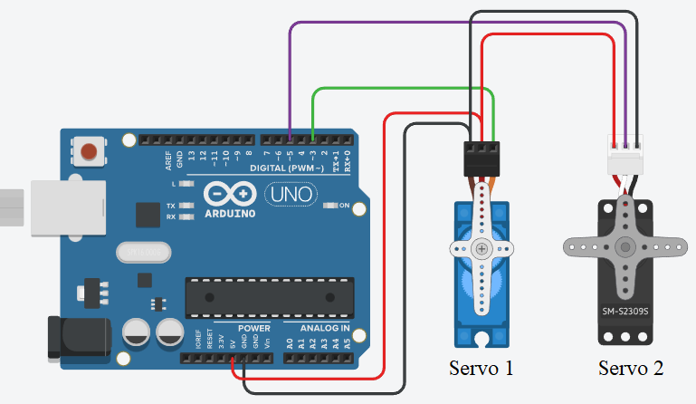
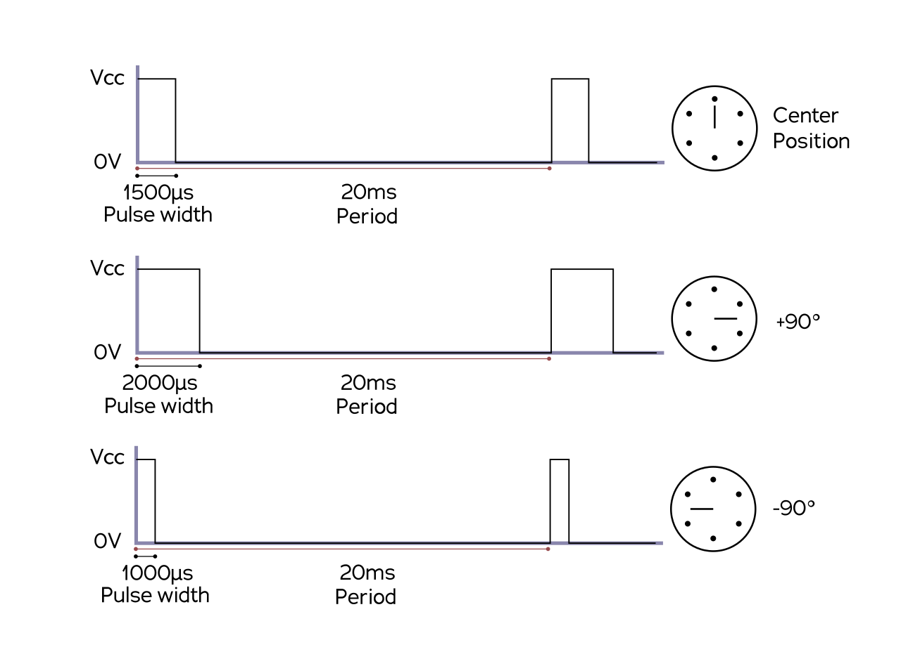

Shutter plugin
==============

The shutter used in this experiment is a low-cost device based on a pulse-width modulation (PWM) driven servo for modeling which is controlled by an arduino board. An anodised blade fixed to the servo's steerer blocks the light beam when placed accordingly

The position is steered by the duty cycle of a pulsed signal, typically with a period of 20ms. The width of the pulse controls the position / angle.

The only thing which matters in the context of this tutorial is that the corresponding actuator plugin has to move the (here simulated) servo back and forth between two positions for shutter closed and shutter opened, respectively. In the controller file we implement a generic :code:`MocActuator` which is specialised as needed.

.. code-block::

    class MockActuator:

	def __init__(self, current=0):
	    self._target_value = current
	    self._current_value = current

	def move_at(self, value):
	    self._target_value = value
	    self._current_value = value

	def get_value(self):
	    return self._current_value

    class MockShutter(MockActuator):

	def __init__(self, current=0):
	    MockActuator.__init__(self, current)
	    self.open_value = 1200
	    self.closed_value = 1800
	    self.epsilon = 10

	@property
	def is_closed(self):
	    return abs(self._current_value - self.closed_value) <= self.epsilon

At present, we need only a single shutter. More devices will follow later on. The simulation has to know whether the sample cuvette contains the real sample or solvent only. This is taken care of by the flag :code:`with_sample`.

.. code-block::
   :emphasize-lines: 6,10-

    @dataclass
    class MockSpectrograph:

        ...
	absorption: float = 0.3
	shutter_names = ['dark']

        def __post_init__(self):
	    self.calculate_base_data()
	    self.with_sample = True
	    self.shutter = { name: MockShutter(1200)
	                     for name in self.shutter_names }

When recording a spectrum, the state of the shutter has to be taken into account, as well as the nature of the sample. This is the reason why the shutter plugin has to be declared as a slave sharing the spectrometer's controller. In a real experiment these two plugins would operate independently of each other.
			  
.. code-block::
   :emphasize-lines: 7,8,10-

    class MockSpectrograph:

    ...

	def grab_spectrum(self):
	    time.sleep(max(self.integration_time * 1e-6, 0.001))
	    return self.simulate_spectrum(self.get_shutter_value('dark') > 0,
					  self.with_sample)

	def get_shutter_value(self, axis):
	    return self.shutter[axis].get_value()

	def set_shutter_value(self, axis, value):
	    return self.shutter[axis].move_at(value)

Next, we have to rename the template file for the move plugin.

.. code-block::

   .../daq_move_plugins$ git mv daq_move_Template.py daq_move_MockShutter.py

Rename the class and pay attention to the naming convention. The preamble of the class contains the definition of a few properties. They don't really matter here because everything is simulated. The two parameters for open and closed position indicate where the servo has to be set when the binary actuator is set to zero and one for closed and open, respectively.

.. code-block::

    class DAQ_Move_MockShutter(DAQ_Move_base):

        is_multiaxes = True
	_axis_names = MockSpectrograph.shutter_names[:2]
	_controller_units = '' #: Union[str, List[str]] = ['mm', 'mm']
	_epsilon = 0.1
	data_actuator_type = DataActuatorType.DataActuator

	params = [
	  {'title': 'Closed position', 'name': 'closed', 'type': 'int',
	   'min': 500, 'max': 2100, 'value': 1200 },
	  {'title': 'Open position', 'open', 'type': 'int',
	   'min': 500, 'max': 2100, 'value': 1800 },
	] + comon_parameters_fun(is_multiaxes, _axis_names, epsilon=_epsilon)

	def ini_attributes(self):
	    self.controller: MockSpectrometer = None

The initialisation procedure is similar to the one of a detector plugin.

.. code-block::

    class DAQ_Move_MockShutter(DAQ_Move_base):

        ...

        def ini_stage(self, controller=None):
	    if self.is_master:
		self.controller = MockSpectrograph()
	    else:
		self.controller = controller

	    info = "Mock polarizer line initialised"
	    return info, True

	def close(self):
	    pass

We could make ourselves life easier here by just passing on values to the controller or controlling servo values directly by the actuator value. However, i) for the time being, binary actuators handle per default only zero and one and ii) when using real servo shutters in the lab, the code is already there (they're pretty cheap and easy to make and to use).

.. code-block::

    class DAQ_Move_MockShutter(DAQ_Move_base):

        ...

	def commit_settings(self, param: Parameter):
	    axis = self.settings['multiaxes', 'axis']
	    if param.name() == 'closed':
	        if self.controller.set_closed_value('axis', param.value())
	    elif param.name() == 'open':
	        if self.controller.set_open_value('axis', param.value())

Finally, the methods for getting and setting the actuator's value, once again and for the same reason boiler-plate code only.

.. code-block::

    class DAQ_Move_MockShutter(DAQ_Move_base):

        ...

	def get_actuator_value(self):
	    axis = self.settings['multiaxes', 'axis']
	    pos = DataActuator(data=self.controller.get_shutter_value(axis),
			       units=self.axis_unit)
	    pos = self.get_position_with_scaling(pos)
	    return pos

	def move_abs(self, value: DataActuator):
	    value = self.check_bound(value)
	    self.target_value = value
	    value = self.set_position_with_scaling(value)
	    axis = self.settings['multiaxes', 'axis']
	    self.controller.set_shutter_value(axis, value.value(self.axis_unit))
	    self.emit_status(ThreadCommand('Update_Status',
					   ['Moved shutter %s' % axis]))

	def move_rel(self, value: DataActuator):
	    axis = self.settings['multiaxes', 'axis']
            self.move_abs(self.get_actuator_value(axis) + value)

	def move_home(self):
	    self.emit_status(ThreadCommand('Update_Status',
					   ['Move Home not implemented']))

	def stop_motion(self):
	    self.move_done()

    if __name__ == '__main__':
	main(__file__)
